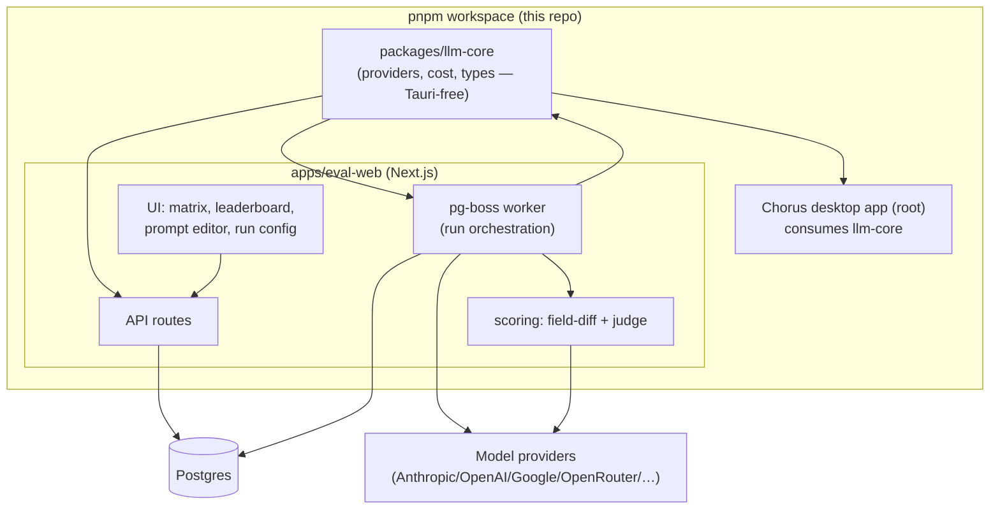
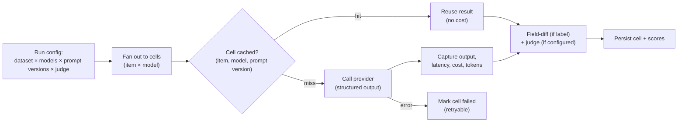
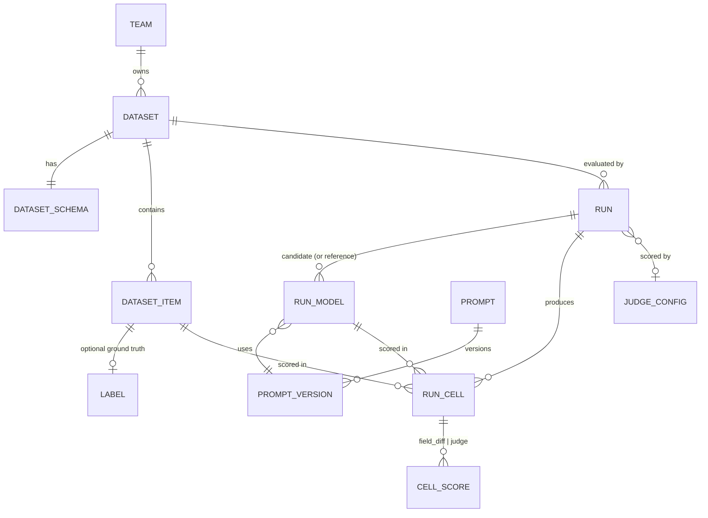

# feat: Image-Model Evaluation Webapp

## Summary

Build a new hosted, multi-user web app that runs an image dataset through several candidate models at once and presents a scored comparison matrix and leaderboard — per-image output, latency, cost, field-level accuracy against labels, and an LLM-judge score against a rubric. It is a new Next.js + Postgres application built on a Tauri-free `llm-core` package extracted from Chorus and shared with the desktop app. The goal is to make migrating off gpt-4o (cheaper, newer, equal-or-better) a repeatable workflow the client team owns.

---

## Problem Frame

A client's production app turns a food-plate photo into structured output via an elaborate prompt and internal criteria, running on gpt-4o today. gpt-4o is heading toward deprecation and they want a cheaper, newer model at equal-or-better quality — but they can't switch on vibes. They have an internal image dataset (with partial ground-truth labels) and written criteria, and they need to see, per candidate model, whether quality holds, what it costs, and how fast it is. The need is recurring: every time a new model ships, the same comparison returns. The brainstorm (`docs/brainstorms/2026-06-13-image-model-eval-webapp-requirements.md`) settled this as a run-centered comparison-matrix product, not a decision cockpit — the team reads the matrix and makes the call.

Chorus already has the load-bearing internals (a multi-provider calling layer, cost calculation, per-provider image encoding), but they live inside a Tauri/Mac desktop app with local SQLite. The work is to extract those internals cleanly and build a server-side eval harness and web UI around them — plus three capabilities Chorus does not have today: a request/response adapter with latency capture, structured (JSON-schema) output per provider, and background job execution.

---

## Requirements

Traceability is to the origin requirements doc (`see origin`). Origin R-IDs are cited per implementation unit.

**Datasets and scoring**
- P1. Store image/text datasets with optional per-item ground-truth labels and one canonical output schema per dataset (origin R1–R4).
- P2. Score each structured output two ways where applicable: configurable per-field diff against labels, and an LLM-judge rubric score; show both side-by-side, neither canonical (origin R15–R18).
- P3. Judge is configurable per run: model selector + custom rubric prompt, with access to input, output, label, and gpt-4o reference output (origin R19–R20).

**Runs and execution**
- P4. Configure a run from a dataset, candidate models (with gpt-4o includable as a reference column), and a prompt variant per model; record full config for reproducibility (origin R5–R7).
- P5. Execute runs as background jobs with live progress, partial-failure handling, retry without full re-run, per-cell result reuse, and concurrency control against provider rate limits (origin R11–R14).
- P6. Capture and persist per-call latency and cost for every cell, with a single canonical cost source recorded per cell (origin R24; new — see KTD4).

**Prompts**
- P7. Author prompts in-app with a shared/default starting point and per-model variants; version them so every result attributes to a specific prompt version × model (origin R8–R10).

**Surfaces**
- P8. Present a comparison matrix (images × model-prompt cells) with per-cell output, latency, cost, and score(s), drillable to per-field diffs and judge rationale (origin R21, R24).
- P9. Present a leaderboard ranking model+prompt on quality, latency, and projected production cost (per ~1,000 items) as the headline cost figure, distinct from eval-run cost, with gpt-4o shown as the reference (origin R22–R23, R6).

**Platform**
- P10. Hosted and multi-user: team members share datasets, runs, and results; a teammate can open a completed run and read the same matrix/leaderboard (origin R25–R26).
- P11. Support general text-comparison inputs (text-only or image+text), degrading cleanly to judge-only scoring when no schema/label applies (origin R3, AE5).

---

## Key Technical Decisions

- KTD1. **Extract a Tauri-free `llm-core` package as a prerequisite, not a copy.** `src/core/chorus/Models.ts` imports `@tauri-apps/plugin-sql` and `@tauri-apps/plugin-fs` at module level, so importing the provider types transitively pulls Tauri into Node. We split pure types/providers/cost into a shared workspace package consumed by both the desktop app and the new web app, rather than vendoring a fork that drifts (see origin Dependencies). Repo placement: a pnpm workspace inside this repo.
- KTD2. **Build the eval harness on the non-streaming `ISimpleCompletionProvider.complete()` shape, extended for structured output.** The streaming `IProvider.streamResponse` callback contract (`src/core/chorus/ModelProviders/IProvider.ts`) is heavier than a batch eval needs. The `simple/` family (`src/core/chorus/ModelProviders/simple/`) is already a non-streaming "prompt in, text out" interface with zero Tauri deps — the right base for a request/response adapter that returns `{ output, usage, latencyMs }`.
- KTD3. **Structured output is net-new, added per provider.** No provider supports `response_format` / `json_schema` / `responseSchema` today. We add JSON-schema-constrained output per provider (OpenAI `response_format`, Anthropic forced-tool or prefill, Google `responseSchema`/`responseMimeType`), because both field-level diff and reliable judge JSON depend on it.
- KTD4. **Pin one canonical cost source per cell and record it.** Chorus has two cost paths that disagree by design: OpenRouter's authoritative generation endpoint vs. `calculateCost` from token counts × static pricing. Each cell records which source produced its cost so the leaderboard never mixes authoritative and estimated costs silently. Projected production cost extrapolates per-item average cost to ~1,000 items.
- KTD5. **Measure latency in the adapter.** Latency exists nowhere in Chorus today. The request/response adapter times each call (total, and time-to-first-token where the streaming path is used) and persists it per cell; where OpenRouter is the provider, surface its `generation_time`/`latency` fields (currently discarded by `fetchOpenRouterCost`).
- KTD6. **Stack: Next.js (App Router) + Postgres + Drizzle + pg-boss.** A single TS codebase for UI and API routes; Postgres as the shared store; Drizzle for typed schema; pg-boss for Postgres-backed background jobs (no extra Redis infra at medium scale). The new Postgres app uses normal constraints — Chorus's "no foreign keys" rule is a SQLite-app policy, treated as Chorus-local.
- KTD7. **Per-field match rules live on the dataset schema.** Each schema field declares its matcher: exact (categorical), numeric tolerance (e.g., calories within ±X%), or set overlap / precision-recall (list fields like food items). This is the field-diff contract; the schema is fixed per dataset (origin assumption).

---

## High-Level Technical Design

### Component architecture



### Run orchestration flow



### Data model



Key fields: `RUN_CELL` carries `status`, `output_json`, `latency_ms`, `cost_usd`, `cost_source`, `prompt_tokens`, `completion_tokens`, `error`. `CELL_SCORE` carries `scorer_type`, `score`, `details_json` (per-field results), `rationale` (judge). `DATASET_SCHEMA` carries the JSON schema plus per-field match rules (KTD7).

---

## Output Structure

```text
pnpm-workspace.yaml                 # new: declares packages/* and apps/*
packages/
  llm-core/                         # new: Tauri-free extraction (KTD1)
    src/
      providers/                    # moved/adapted from src/core/chorus/ModelProviders
      types.ts                      # pure types split out of Models.ts
      cost.ts                       # calculateCost, formatCost, fetchOpenRouterCost
      complete.ts                   # request/response + latency adapter (KTD2, KTD5)
      structuredOutput.ts           # per-provider JSON-schema support (KTD3)
apps/
  eval-web/                         # new: Next.js app
    app/                            # routes: datasets, runs, matrix, leaderboard, prompts
    server/
      db/                           # Drizzle schema + migrations
      jobs/                         # pg-boss worker + run orchestration
      scoring/                      # field-diff + judge scorers
      images/                       # Node image source (replaces readImageAttachment)
```

The existing Chorus desktop app stays at the repo root and switches its provider imports to `@chorus/llm-core`. The tree is a scope declaration; per-unit `**Files:**` are authoritative.

---

## Implementation Units

### Phase A — Foundations

### U1. Extract Tauri-free `llm-core` workspace package

- **Goal:** A shared package containing the provider layer, pure types, and pure cost functions, importable in Node with no Tauri dependency. The desktop app consumes it unchanged in behavior.
- **Requirements:** Enables P1–P11 (foundation); origin Dependencies/Assumptions.
- **Dependencies:** none.
- **Files:**
  - `pnpm-workspace.yaml` (new)
  - `packages/llm-core/package.json`, `packages/llm-core/tsconfig.json` (new)
  - `packages/llm-core/src/providers/*` (adapted from `src/core/chorus/ModelProviders/*`, `src/core/chorus/OpenAICompletionsAPIUtils.ts`)
  - `packages/llm-core/src/types.ts` (pure types split from `src/core/chorus/Models.ts`: `LLMMessage`, `ModelConfig`, `UsageData`, `ApiKeys`, `getProviderName`, `StreamResponseParams`)
  - `packages/llm-core/src/cost.ts` (pure parts of `src/core/chorus/api/CostAPI.ts`: `calculateCost`, `formatCost`, `fetchOpenRouterCost`)
  - `packages/llm-core/src/util/proxy.ts` (from `src/core/utilities/ProxyUtils.ts`)
  - Root app imports updated to `@chorus/llm-core` (touch points across `src/core/chorus/`)
- **Approach:** Split `Models.ts` into pure types (to the package) and Tauri-bound IO (stays in the desktop app: `db`, attachment readers, `download*Models`). Move providers + `OpenAICompletionsAPIUtils` + `ProxyUtils` + pure cost into the package. Drop `dangerouslyAllowBrowser: true` and update OpenRouter `HTTP-Referer`/`X-Title` headers to be configurable (the app sets its own identity). The desktop app keeps its attachment readers and passes already-encoded attachments into the providers as it does today.
- **Execution note:** Characterization-first — capture the desktop app's current provider behavior (build + a smoke pass of an existing chat) before and after the move; this unit must not change desktop behavior.
- **Patterns to follow:** Existing path-alias and import-grouping conventions (AGENTS.md); `I`-prefixed interfaces; `undefined` over `null`.
- **Test scenarios:**
  - Package builds and type-checks standalone with no `@tauri-apps/*` in its dependency graph (assert via import graph / build with Tauri absent).
  - `calculateCost` and `formatCost` produce identical results pre- and post-extraction for representative token/price inputs (incl. sub-cent formatting).
  - A provider instance constructed from the package issues the same request shape as before for a text-only message (snapshot of the built request body per provider).
  - Desktop app still builds and a smoke chat against one provider still streams (characterization).
- **Verification:** `llm-core` builds in isolation; desktop app builds and an existing chat works unchanged; no Tauri symbols resolve inside the package.

### U2. Request/response adapter with latency capture

- **Goal:** A single awaited call — `complete(request) → { output, usage, latencyMs, costSource? }` — over the provider layer, suitable for batch eval, capturing latency that does not exist today.
- **Requirements:** P5, P6; origin R24 (new latency capture, KTD2, KTD5).
- **Dependencies:** U1.
- **Files:**
  - `packages/llm-core/src/complete.ts` (new)
  - `packages/llm-core/src/types.ts` (extend with adapter request/response types)
- **Approach:** Build on the `simple/` family where available; for providers only exposing streaming, wrap `streamResponse`, accumulate chunks, resolve on `onComplete`, reject on `onError`. Time total duration; capture time-to-first-token from the first `onChunk` when streaming. Carry `UsageData` through; mark tokens/cost `unavailable` when a provider returns no usage (local providers may). Where OpenRouter is used, extend cost retrieval to also surface `generation_time`/`latency`.
- **Patterns to follow:** `src/core/chorus/api/MessageAPI.ts` `onComplete` cost/usage logic (the reference for choosing OpenRouter-authoritative vs. computed cost) — reimplement without SQLite writes.
- **Test scenarios:**
  - Happy path: a mocked provider returning two chunks resolves with concatenated output and a populated `latencyMs`.
  - Edge: provider returns no `UsageData` → response marks tokens/cost unavailable rather than zero.
  - Error path: provider invokes `onError` → adapter rejects with the error, no partial resolve.
  - Cost source: OpenRouter path records `cost_source = openrouter_authoritative`; non-OpenRouter records `cost_source = computed` (Covers the canonical-source requirement, KTD4).
- **Verification:** Adapter returns a typed result with latency for every provider in a contract test; failure and missing-usage states are explicit.

### U3. Structured (JSON-schema) output per provider

- **Goal:** Constrain a model's output to a JSON schema, per provider, so structured outputs and judge verdicts are reliably parseable.
- **Requirements:** P2, P3, origin R4/R15/R16 (KTD3).
- **Dependencies:** U2.
- **Files:**
  - `packages/llm-core/src/structuredOutput.ts` (new)
  - `packages/llm-core/src/providers/*` (extend OpenAI, Anthropic, Google, OpenRouter paths)
- **Approach:** Add an optional `responseSchema` to the adapter request. OpenAI: `response_format` with `json_schema` (strict). Anthropic: forced single-tool whose input schema is the response schema (reusing existing tool plumbing), or prefill — pick per reliability. Google: `responseSchema` + `responseMimeType: application/json`. Parse and validate the returned JSON against the schema; surface a typed "schema-violation" outcome distinct from a transport error.
- **Test scenarios:**
  - Happy path per provider: given a small schema, the returned object validates against it.
  - Edge: model returns prose/invalid JSON → adapter yields a schema-violation outcome, not a crash.
  - Edge: nested object + array-of-objects schema round-trips (mirrors a food-items list).
  - Integration: the same logical schema produces a conforming object across all four providers (parametrized contract test, mocked transport).
- **Verification:** Each provider returns schema-valid JSON for a representative schema; violations are a distinct, handled outcome.

### U4. Web app scaffold, data model, auth, multi-user

- **Goal:** A running Next.js app with Postgres + Drizzle schema, pg-boss wired, and team-scoped auth so datasets/runs/results are shared within a team.
- **Requirements:** P10; foundation for all surfaces (origin R25–R26).
- **Dependencies:** U1.
- **Files:**
  - `apps/eval-web/package.json`, app config (new)
  - `apps/eval-web/server/db/schema.ts`, `apps/eval-web/server/db/migrations/*` (new — entities per Data Model)
  - `apps/eval-web/server/jobs/queue.ts` (pg-boss setup, new)
  - `apps/eval-web/server/auth/*` (new)
  - `apps/eval-web/app/*` (shell layout + auth-gated routes)
- **Approach:** Define entities: `team`, `user`, `dataset`, `dataset_schema`, `dataset_item`, `label`, `prompt`, `prompt_version`, `judge_config`, `run`, `run_model`, `run_cell`, `cell_score` (KTD6 stack, normal Postgres constraints). All reads/writes are team-scoped. Bring-your-own provider API keys stored per team (encrypted at rest), consistent with origin assumptions.
- **Patterns to follow:** Standard Next.js App Router + Drizzle migration conventions; strict TS.
- **Test scenarios:**
  - Migration applies cleanly to an empty database and is reversible.
  - Auth: a user in team A cannot read team B's dataset or run (authorization test on the query layer).
  - A persisted run is reopenable by a different user in the same team and returns identical stored data (Covers origin R26).
  - `Test expectation: none` for pure layout/shell files — covered by route smoke only.
- **Verification:** App boots, migrations apply, auth gates routes, team isolation holds.

### Phase B — Eval engine

### U5. Dataset ingestion and Node image source

- **Goal:** Upload/manage datasets (image, text, or image+text items), attach optional labels and a per-dataset schema with per-field match rules, and provide a Node image source feeding the providers' existing base64 encoders.
- **Requirements:** P1, P11, P7-data (KTD7); origin R1–R4, AE5.
- **Dependencies:** U3, U4.
- **Files:**
  - `apps/eval-web/server/images/source.ts` (new — replaces `readImageAttachment`; reads stored bytes → base64)
  - `apps/eval-web/server/db/schema.ts` (dataset/item/label/schema tables)
  - `apps/eval-web/app/datasets/*` (upload + schema editor UI)
- **Approach:** Store image bytes (object storage or DB blob — settled in Open Questions) and feed base64 to the per-provider encoders already in `llm-core` (Anthropic structured `source` with magic-byte sniffing; OpenAI `input_image`; Chat-Completions `image_url`). The schema editor lets the user define fields and pick each field's matcher (exact / numeric-tolerance / set-overlap). Items may be text-only (no schema/label) for general comparison.
- **Patterns to follow:** Per-provider image block shapes from `packages/llm-core/src/providers/*` (do not port `AttachmentsHelpers.ts` — Tauri/canvas bound).
- **Test scenarios:**
  - Image item round-trips: stored bytes → base64 → correct per-provider block shape for each provider (jpeg/png magic-byte detection for Anthropic).
  - A dataset item with a label and a schema is persisted with per-field match rules intact.
  - Edge: a text-only item is accepted with no schema/label and is flagged judge-only-eligible (Covers AE5).
  - Edge: oversized/unsupported image type is rejected with a clear error.
- **Verification:** Datasets with mixed labeled/unlabeled and image/text items persist; images reach each provider in the correct shape without Tauri.

### U6. Prompt management and versioning

- **Goal:** Author a shared/default prompt and per-model variants; version every change so results attribute to a specific prompt version × model.
- **Requirements:** P7; origin R8–R10.
- **Dependencies:** U4.
- **Files:**
  - `apps/eval-web/server/db/schema.ts` (`prompt`, `prompt_version`)
  - `apps/eval-web/app/prompts/*` (editor + version history UI)
- **Approach:** A prompt has a shared base and derived per-model variants; editing creates a new immutable `prompt_version`. Runs reference `prompt_version` ids (not mutable prompts) so historical results stay attributable.
- **Test scenarios:**
  - Editing a prompt creates a new version; prior versions remain readable.
  - A per-model variant derives from the shared base and overrides it for that model only.
  - A run references a fixed `prompt_version`; later edits do not alter that run's attribution.
- **Verification:** Version history is immutable and every result links to one prompt version.

### U7. Run orchestration (background fan-out engine)

- **Goal:** Execute a run as a background job that fans out across items × models, calls providers with structured output, captures output/latency/cost per cell, scores, handles partial failure and retry, and reuses cached cells.
- **Requirements:** P4, P5, P6; origin R5–R7, R11–R14.
- **Dependencies:** U2, U3, U5, U6, U8.
- **Files:**
  - `apps/eval-web/server/jobs/runOrchestrator.ts` (new)
  - `apps/eval-web/server/jobs/cellCache.ts` (new — content-addressed by item × model × prompt_version × params)
  - `apps/eval-web/app/runs/*` (config + live progress UI)
- **Approach:** On launch, snapshot config (dataset version, models, prompt versions, judge) into the `run`. Enqueue one job per cell via pg-boss with a concurrency cap honoring provider rate limits. Each cell: check cache → call adapter (U2) with the schema (U3) → persist output/latency/cost/`cost_source`/tokens → invoke scorers (U8). Failures mark the cell `failed` with the error and are individually retryable; succeeded cells persist so retries and added models reuse them. Progress (completed/total, failures) is queryable for live UI.
- **Execution note:** Start with a failing integration test for the fan-out contract (N items × M models → N×M cells with correct statuses) before implementing the orchestrator.
- **Test scenarios:**
  - Happy path: a 5-item × 2-model run produces 10 cells, each with output, latency, cost, and scores.
  - Partial failure: 3 of 200 cells error on a simulated timeout → those 3 are `failed` and retryable; the other 197 succeed (Covers origin R12).
  - Retry reuse: retrying the 3 failed cells re-executes only those 3; the 197 are served from cache with no new provider calls/cost (Covers origin R13, AE2).
  - Added model: adding a model to a completed run computes only the new column; existing cells are reused.
  - Concurrency: enqueued cells never exceed the configured concurrency cap (assert max in-flight).
  - Integration: a launched run updates progress counts as cells complete (not mock-only — exercises queue → persist → progress).
- **Verification:** Runs complete or partially complete with accurate per-cell state, reuse on retry, and bounded concurrency.

### U8. Scoring engine (field-diff + judge)

- **Goal:** Score a cell's structured output with a configurable per-field diff against the label and an LLM-judge rubric score; persist both with neither marked canonical.
- **Requirements:** P2, P3; origin R15–R20, AE1, AE3.
- **Dependencies:** U3 (judge needs structured output), U5 (schema/labels).
- **Files:**
  - `apps/eval-web/server/scoring/fieldDiff.ts` (new — exact / numeric-tolerance / set-overlap matchers)
  - `apps/eval-web/server/scoring/judge.ts` (new — judge model + rubric prompt → score + rationale via structured output)
  - `apps/eval-web/server/db/schema.ts` (`cell_score`, `judge_config`)
- **Approach:** Field-diff dispatches each field to its declared matcher (KTD7), producing per-field pass/fail/score in `details_json` so a single regressed field is visible (not collapsed to one pass/fail). Judge calls the configured model with a rubric prompt that can reference input, output, label, and the gpt-4o reference output, returning a structured `{ score, rationale }`. Where both scores exist for a cell, both persist independently.
- **Test scenarios:**
  - Field-diff exact: categorical field mismatch scores that field incorrect.
  - Field-diff numeric tolerance: calories within ±tolerance pass; outside fail (boundary values tested).
  - Field-diff set overlap: food-items list scored by precision/recall, order-independent.
  - Per-field visibility: a correct-items / wrong-calories output shows calories incorrect, not a single fail (Covers AE3).
  - Judge: a mocked judge returns a structured score + rationale; invalid judge JSON is a handled outcome (reuses U3 violation path).
  - Dual scoring: a labeled item with a judge configured persists both scores side-by-side; an unlabeled item persists judge-only (Covers AE1).
- **Verification:** Both scorers run independently, per-field detail is preserved, and dual/judge-only cases persist correctly.

### Phase C — Surfaces

### U9. Comparison matrix and cell drill-down

- **Goal:** The central matrix — images (rows) × model-prompt cells (columns) — with per-cell output, latency, cost, and score(s), drillable to per-field diffs and judge rationale.
- **Requirements:** P8; origin R21, R24, R17.
- **Dependencies:** U7, U8.
- **Files:**
  - `apps/eval-web/app/runs/[id]/matrix/*` (new)
  - `apps/eval-web/server/api/runResults.ts` (new — read model for matrix)
- **Approach:** Render the persisted run; cells show output summary, latency, cost, and both scores side-by-side when present. Drill-down opens a cell's full structured output, the per-field diff (`details_json`), and the judge rationale. gpt-4o reference column is visually distinguished. Failed cells are visible and retry-triggering.
- **Test scenarios:**
  - Matrix renders N×M cells from persisted data with the gpt-4o column marked as reference.
  - A cell with both scores shows both; an unlabeled cell shows judge-only (Covers R17).
  - Drill-down surfaces per-field diff and judge rationale for a cell.
  - A failed cell renders a retry affordance that triggers U7 retry.
- **Verification:** A completed run's matrix and drill-downs match persisted data; reference column is distinct.

### U10. Leaderboard and projected production cost

- **Goal:** Aggregate model+prompt performance across the dataset — quality score(s), latency, and projected production cost (per ~1,000 items) as the headline cost, distinct from eval-run cost — with gpt-4o as reference.
- **Requirements:** P9; origin R22–R23, R6.
- **Dependencies:** U7, U8.
- **Files:**
  - `apps/eval-web/app/runs/[id]/leaderboard/*` (new)
  - `apps/eval-web/server/api/leaderboard.ts` (new — aggregation)
- **Approach:** Aggregate cell scores/latency/cost per `run_model`. Compute projected production cost = mean per-item cost × 1,000 (extrapolation noted as such), shown beside the also-available eval-run cost. Rank candidates against the gpt-4o reference on quality, latency, and projected cost; do not gate (run-centered, per origin Key Decisions — the team reads and decides).
- **Test scenarios:**
  - Aggregation: per-model mean quality/latency and summed cost match the underlying cells.
  - Projected cost: per-1,000 projection equals mean per-item cost × 1,000 for a known fixture; eval-run cost is reported separately.
  - Mixed cost sources: a model whose cells used `computed` cost is not silently combined with `openrouter_authoritative` cells without indication (KTD4).
  - gpt-4o reference row is present and labeled; ranking does not auto-promote or gate.
- **Verification:** Leaderboard numbers reconcile with cell data; projected production cost is the headline figure and clearly distinct from eval-run cost.

---

## Scope Boundaries

### Deferred for later (from origin)
- Automated prompt optimization (propose variants, judge as fitness function, converge on best per model). The prompt/version data model leaves room for it.
- Rich labeling/annotation tooling at scale (e.g., promoting trusted gpt-4o outputs to silver labels with human confirmation). v1 accepts existing partial labels and lightweight confirmation only.
- Formal pass/fail gating and a "promote this model" decision artifact (the cockpit framing set aside in favor of the run-centered matrix).

### Outside this product's identity (from origin)
- Not the production inference path — this is an offline evaluation tool; it does not serve live food-plate requests.
- Not a port of Chorus's chat, projects, or ambient-chat features — it reuses Chorus's provider/cost internals but is a distinct evaluation surface.

### Deferred to follow-up work (plan-local)
- Backfilling Chorus's desktop app to also consume any new `llm-core` capabilities (structured output, latency) beyond what U1 requires for behavior parity.
- Adding a static/fallback pricing map maintained in-repo; v1 sources pricing live (OpenRouter models endpoint) per the existing pattern.

---

## Risks, Dependencies & Assumptions

- **Risk — extraction blast radius (U1).** `Models.ts`'s module-level Tauri imports mean the split must be surgical; a botched extraction breaks the desktop app. Mitigation: characterization-first, behavior-parity smoke before/after, no behavior changes in U1.
- **Risk — structured output reliability varies by provider (U3).** Schema adherence differs (strict mode, forced-tool, prefill). Mitigation: per-provider contract tests and a typed schema-violation outcome that scoring handles rather than crashing on.
- **Risk — cost-source mixing (KTD4).** Combining authoritative and estimated costs would make the leaderboard misleading. Mitigation: record `cost_source` per cell; surface mixing in the leaderboard.
- **Risk — eval-run cost (origin).** Running medium-scale evals (hundreds of images × models × judge) itself costs money. Mitigation: per-cell caching and reuse on retry/added-models; show eval-run cost distinctly.
- **Dependency:** Reuses `src/core/chorus/ModelProviders/*`, `src/core/chorus/OpenAICompletionsAPIUtils.ts`, `src/core/utilities/ProxyUtils.ts`, and pure parts of `src/core/chorus/api/CostAPI.ts`; assumes these remain stable through extraction.
- **Assumption:** One canonical output schema per dataset (resolved from origin Outstanding Questions).
- **Assumption:** Candidate models expose comparable JSON/structured-output behavior once U3 lands; models that cannot are flagged rather than silently scored.
- **Assumption:** Teams supply their own provider API keys (bring-your-own-keys, per Chorus).

---

## Alternatives Considered

- **Separate repo vendoring the core (vs. in-repo workspace, KTD1).** Lower coupling to Chorus, but the vendored core drifts from upstream and re-fixes diverge. Rejected for an ongoing tool whose value is staying current with Chorus's provider layer.
- **BullMQ/Redis for jobs (vs. pg-boss, KTD6).** More capable scheduling and a mature ecosystem, but adds Redis infra. Rejected at medium scale where Postgres-backed jobs suffice; revisit if scale or scheduling needs grow.
- **Build on the streaming `IProvider` directly (vs. the `simple/` request-response shape, KTD2).** Avoids an adapter, but forces every eval call through callback choreography and re-implements accumulation everywhere. Rejected — the adapter is written once and batch eval reads cleaner.
- **Coerce JSON via prompt-only "respond in JSON" (vs. provider structured output, KTD3).** No provider changes, but unreliable parsing undermines field-diff and judge scoring. Rejected as the primary mechanism; provider-native schema constraint is the contract.

---

## Open Questions

### Resolve before planning
None outstanding — hosting foundation (new TS/Node backend), field-diff semantics (configurable per-field), and schema source (one per dataset) were resolved during planning.

### Deferred to implementation
- Image storage substrate: object storage (e.g., S3-compatible) vs. Postgres blob — decide on size/retention/privacy needs during U5.
- Exact projected-production-cost extrapolation: flat per-item mean × 1,000 (default) vs. token-weighted — settle with real cost data in U10.
- Whether `judge_config` is run-scoped only or a reusable library object — decide in U8 based on UX needs.
- Auth provider specifics (session vs. token, SSO) — settle in U4 against the client's identity setup.
- Per-provider rate-limit values for the concurrency cap — tune in U7 against real provider limits.

---

## Sources & Research

- Origin requirements: `docs/brainstorms/2026-06-13-image-model-eval-webapp-requirements.md`.
- Provider/cost reuse map (repo research): `IProvider` and `StreamResponseParams` in `src/core/chorus/ModelProviders/IProvider.ts` and `src/core/chorus/Models.ts`; per-provider image shapes in `src/core/chorus/ModelProviders/ProviderAnthropic.ts`, `ProviderOpenAI.ts`, and `src/core/chorus/OpenAICompletionsAPIUtils.ts`; the non-streaming `src/core/chorus/ModelProviders/simple/` family; pure cost functions in `src/core/chorus/api/CostAPI.ts`; cost/usage `onComplete` reference in `src/core/chorus/api/MessageAPI.ts`; latency-display reference in `src/ui/components/Metrics.tsx`; Tauri-bound ingestion (do not port) in `src/core/chorus/AttachmentsHelpers.ts`.
- Verified facts shaping the plan: no structured-output support exists in any provider today; latency is not captured anywhere; `Models.ts` imports `@tauri-apps/*` at module level; pricing is sourced live from OpenRouter (no static table); two cost sources (OpenRouter-authoritative vs. computed) coexist.
- No `docs/solutions/` learnings store exists yet — capturing the "reuse Chorus core server-side" extraction via `/ce-compound` after U1 lands is recommended.
